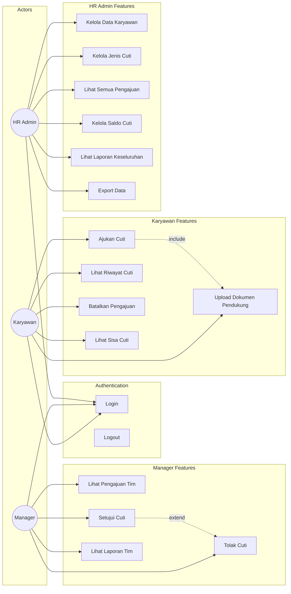
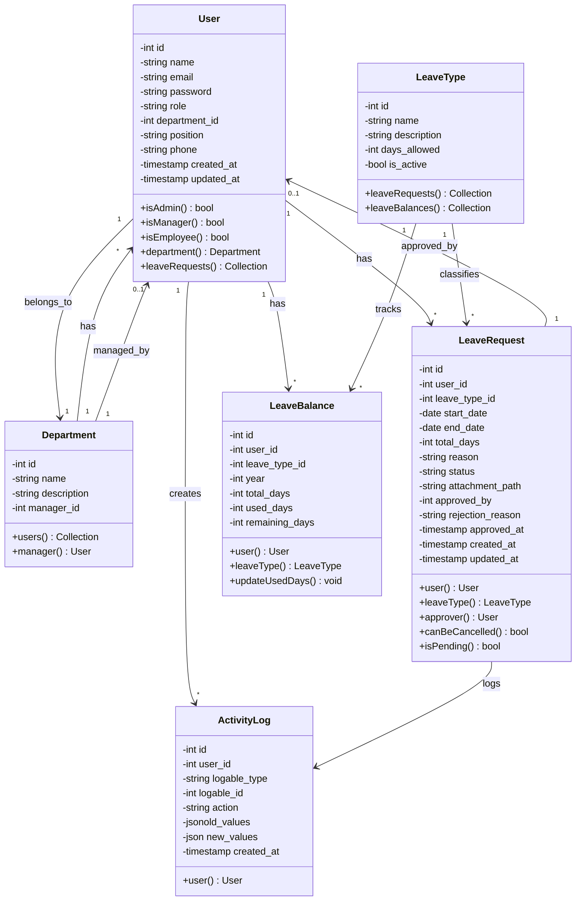
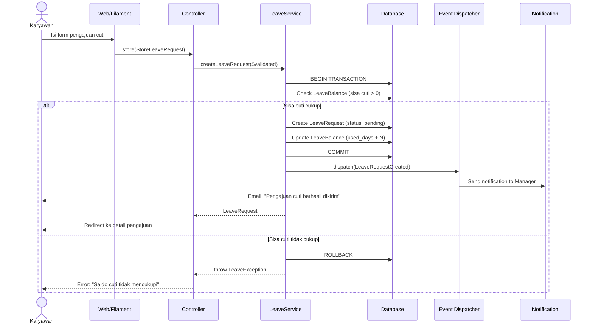
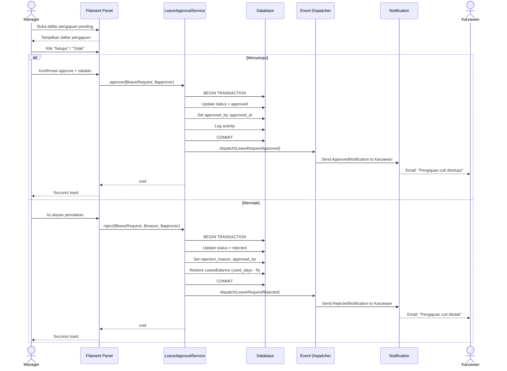
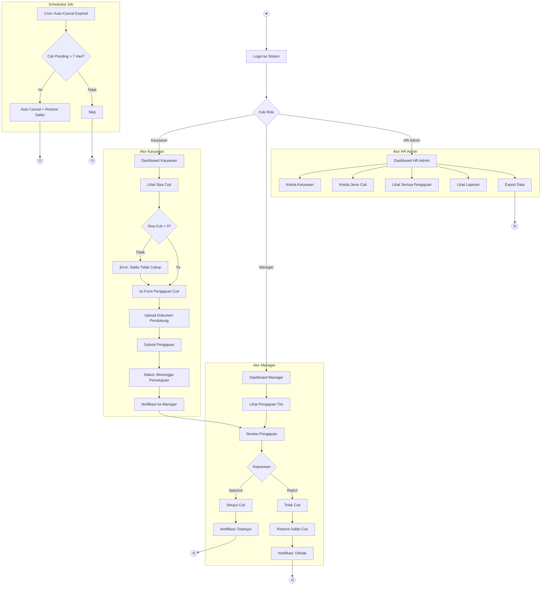
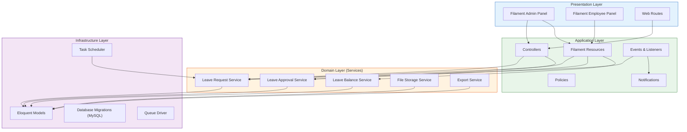
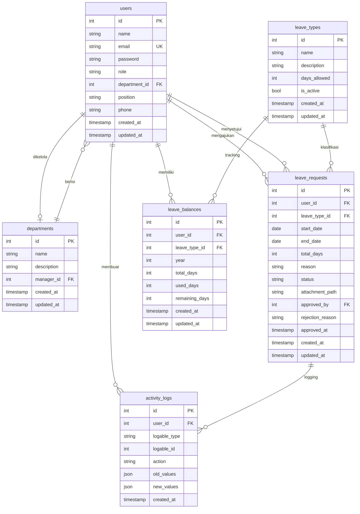

# UML Documentation - Sistem Pengajuan Cuti

## 1. Use Case Diagram

## 2. Class Diagram

## 3. Sequence Diagram - Pengajuan Cuti (Alur Utama)

## 4. Sequence Diagram - Persetujuan Cuti (Alur Kedua)

## 5. Activity Diagram

## 6. Component/Architecture Diagram

## 7. Data Flow Diagram (ERD)

